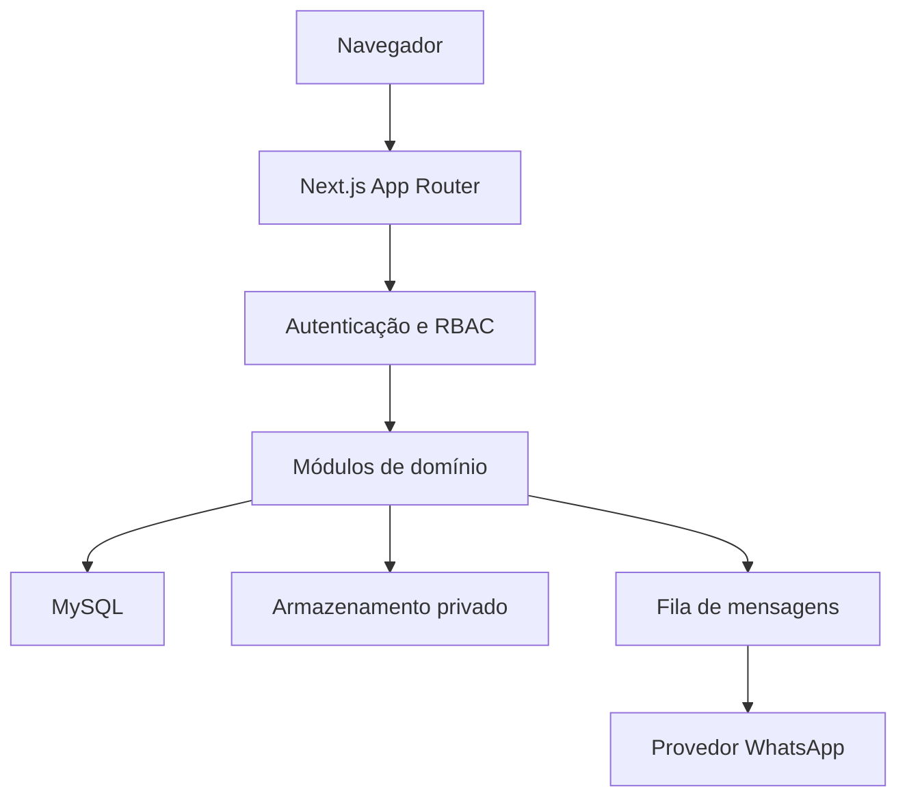

# Arquitetura

## Visão geral

O projeto usa Next.js App Router e TypeScript estrito. Server Components fazem a leitura inicial; Server Actions tratam mutações de formulário; Route Handlers são reservados a downloads, validação de saúde, PDF e cron. A aplicação acessa MySQL diretamente com `mysql2`, sempre por consultas preparadas.

## Camadas

| Camada           | Responsabilidade             | Regra principal                            |
| ---------------- | ---------------------------- | ------------------------------------------ |
| `src/app`        | composição de páginas e HTTP | não concentra regra de negócio             |
| `src/components` | apresentação reutilizável    | sem acesso direto ao banco                 |
| `src/modules`    | casos de uso e consultas     | validação, autorização e transação         |
| `src/core`       | capacidades transversais     | componentes pequenos e independentes       |
| `database`       | integridade relacional       | histórico preservado e chaves estrangeiras |

## Autenticação e autorização

O cookie contém apenas um token aleatório. O banco armazena o SHA-256 desse token, não o token reutilizável. A leitura da sessão verifica expiração, revogação e situação do usuário.

Papéis podem ser:

- globais, em `usuarios_papeis`;
- limitados a uma unidade, em `usuarios_papeis_unidades`.

As permissões resultantes são calculadas no servidor. Toda operação que atua sobre participante, unidade, evento ou documento confirma o `unit_id` antes de ler ou alterar dados.

## Transações importantes

As operações abaixo são atômicas:

- cadastro da pessoa, participante, responsável, consentimento, matrícula e vínculo atual;
- solicitação e efetivação de transferência;
- criação de fila e destinatários;
- emissão ou revogação de certificado;
- alteração de senha com revogação das demais sessões.

Uma falha em qualquer etapa reverte o conjunto. Arquivos enviados são removidos quando a persistência no banco falha.

## Transferências

O vínculo anterior nunca é sobrescrito. A efetivação:

1. bloqueia a matrícula e o ponteiro atual;
2. confirma que a origem ainda é a vigente;
3. encerra o vínculo anterior;
4. cria o vínculo de destino;
5. troca `matriculas_vinculo_atual`;
6. registra histórico e auditoria.

Os gatilhos do banco substituem o `CHECK` que é incompatível com algumas combinações de MySQL/MariaDB e chaves estrangeiras. Assim, uma transferência `EFETIVADA` exige destino, usuário e data sem provocar o erro `#1901`.

## Dados sensíveis

| Dado                  | Em repouso                | Pesquisa                 |
| --------------------- | ------------------------- | ------------------------ |
| CPF                   | AES-256-GCM               | HMAC-SHA-256 normalizado |
| telefone/e-mail       | AES-256-GCM               | HMAC-SHA-256 normalizado |
| observações sensíveis | AES-256-GCM               | não indexada             |
| senha                 | Argon2id irreversível     | não aplicável            |
| token de sessão       | somente SHA-256 no banco  | igualdade pelo hash      |
| documento             | arquivo privado + SHA-256 | metadados autorizados    |

As chaves de cifra e HMAC são diferentes. O valor HMAC permite localizar igualdade sem armazenar o dado em texto puro.

## Documentos e certificados

Uploads são limitados por tamanho e identificados pelos bytes reais, não pela extensão fornecida. A `storage_key` é gerada pelo servidor. O caminho resolvido precisa permanecer dentro de `PRIVATE_STORAGE_PATH`.

O certificado é gerado como PDF A4 paisagem com QR Code, identificador público, área ampla para duas assinaturas e validação pública. A validação não revela telefone, CPF, data de nascimento ou responsável.

## Mensageria

A fila separa autorização de envio e processamento. Cada destinatário possui destino cifrado, hash para deduplicação, variáveis cifradas, contador de tentativas e próxima data de tentativa. O provedor nunca é chamado dentro da transação que bloqueia a fila.

## Escalabilidade

- pool MySQL com limite configurável;
- paginação no servidor;
- índices do esquema voltados às consultas operacionais;
- worker independente da requisição do usuário;
- build `standalone` disponível;
- documentos em diretório persistente, substituível no futuro por S3 compatível.

Com armazenamento local, execute uma única instância ou use volume compartilhado. Para múltiplas instâncias, migre documentos para object storage e mantenha a mesma `NEXT_SERVER_ACTIONS_ENCRYPTION_KEY` em todas elas.
